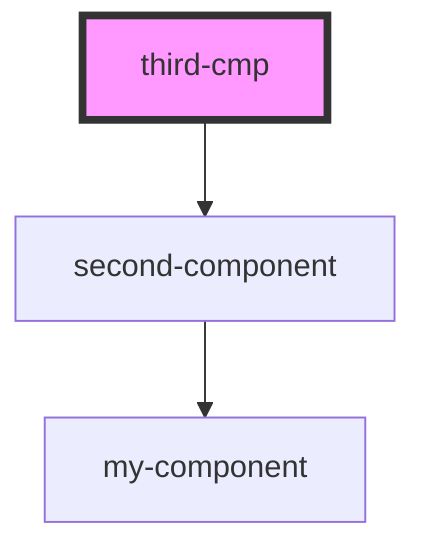

# third-cmp

<!-- Auto Generated Below -->

## Dependencies

### Depends on

- [second-component](../second-component)

### Graph

----------------------------------------------

*Built with [StencilJS](https://stenciljs.com/)*
